# Proof of Touch Grass - Instruction Flow Diagram

```mermaid
graph TB
    Start([Challenger Begins]) --> I1_Start
    subgraph "initialize_user"
        I1_Start[Initialize User]
        I1_Input["Input:<br/>• authority (signer)"]
        I1_Valid{Valid<br/>Inputs?}
        I1_Create[CREATE USER PDA]
        I1_Init["Initialize:<br/>• authority = signer<br/>• total_challenges = 0<br/>• completed = 0<br/>• failed = 0<br/>• total_staked = 0"]
        I1_End[User Account Created]
        I1_Fail[FAILED TXN]
        I1_Start --> I1_Input
        I1_Input --> I1_Valid
        I1_Valid -->|YES| I1_Create
        I1_Valid -->|NO| I1_Fail
        I1_Create --> I1_Init
        I1_Init --> I1_End
    end
    I1_End --> I2_Start
    subgraph "create_challenge"
        I2_Start[Create Challenge]
        I2_Input["Input:<br/>• title, description<br/>• stake_amount<br/>• start_time, end_time<br/>• verification_period<br/>• required_proofs<br/>• required_approvals<br/>• verifiers[]"]
        I2_Valid{Valid<br/>Inputs?}
        I2_Check{"Check:<br/>• user exists?<br/>• stake > 0?<br/>• end > start?<br/>• verifiers count valid?<br/>• approvals <= verifiers?"}
        I2_CreatePDA[CREATE CHALLENGE PDA]
        I2_CreateEscrow[CREATE ESCROW PDA]
        I2_Transfer["TRANSFER SOL:<br/>creator → escrow<br/>(stake_amount)"]
        I2_Init["Initialize:<br/>• creator = signer<br/>• status = Created<br/>• evidence_count = 0<br/>• approval_count = 0<br/>• rejection_count = 0"]
        I2_UpdateUser["UPDATE USER:<br/>• total_challenges++<br/>• total_staked += amount"]
        I2_End[Challenge Created]
        I2_Fail[FAILED TXN]
        I2_Start --> I2_Input
        I2_Input --> I2_Valid
        I2_Valid -->|NO| I2_Fail
        I2_Valid -->|YES| I2_Check
        I2_Check -->|NO| I2_Fail
        I2_Check -->|YES| I2_CreatePDA
        I2_CreatePDA --> I2_CreateEscrow
        I2_CreateEscrow --> I2_Transfer
        I2_Transfer --> I2_Init
        I2_Init --> I2_UpdateUser
        I2_UpdateUser --> I2_End
    end
    I2_End --> I3_Start
    I2_End -.->|optional early exit| I6_Start
    subgraph "submit_evidence"
        I3_Start[Submit Evidence]
        I3_Input["Input:<br/>• ipfs_hash<br/>• metadata<br/>• challenge_id"]
        I3_Valid{Valid<br/>Inputs?}
        I3_Check{"Check:<br/>• submitter = creator?<br/>• status = Active?<br/>• before end_time?<br/>• evidence_count < required?"}
        I3_CreatePDA[CREATE EVIDENCE PDA]
        I3_Store["Store:<br/>• ipfs_hash<br/>• timestamp<br/>• metadata"]
        I3_Increment["UPDATE CHALLENGE:<br/>• evidence_count++"]
        I3_Complete{evidence_count<br/>==<br/>required_proofs?}
        I3_StatusChange["UPDATE STATUS:<br/>→ Verifying"]
        I3_End[Evidence Submitted]
        I3_Fail[FAILED TXN]
        I3_Start --> I3_Input
        I3_Input --> I3_Valid
        I3_Valid -->|NO| I3_Fail
        I3_Valid -->|YES| I3_Check
        I3_Check -->|NO| I3_Fail
        I3_Check -->|YES| I3_CreatePDA
        I3_CreatePDA --> I3_Store
        I3_Store --> I3_Increment
        I3_Increment --> I3_Complete
        I3_Complete -->|NO| I3_End
        I3_Complete -->|YES| I3_StatusChange
        I3_StatusChange --> I3_End
    end
    I3_End -->|loop until all evidence| I3_Start
    I3_End -.->|all evidence submitted| I4_Start
    subgraph "verify_evidence"
        I4_Start[Verify Evidence]
        I4_Input["Input:<br/>• evidence_id<br/>• vote (Approve/Reject)"]
        I4_Valid{Valid<br/>Inputs?}
        I4_Check{"Check:<br/>• verifier in verifiers[]?<br/>• status = Verifying?<br/>• before verification_period_end?<br/>• verifier hasn't voted?"}
        I4_CreatePDA[CREATE VERIFICATION PDA]
        I4_Store["Store:<br/>• verifier<br/>• vote<br/>• timestamp"]
        I4_VoteType{Vote?}
        I4_Approve["UPDATE CHALLENGE:<br/>• approval_count++"]
        I4_Reject["UPDATE CHALLENGE:<br/>• rejection_count++"]
        I4_End[Vote Recorded]
        I4_Fail[FAILED TXN]
        I4_Start --> I4_Input
        I4_Input --> I4_Valid
        I4_Valid -->|NO| I4_Fail
        I4_Valid -->|YES| I4_Check
        I4_Check -->|NO| I4_Fail
        I4_Check -->|YES| I4_CreatePDA
        I4_CreatePDA --> I4_Store
        I4_Store --> I4_VoteType
        I4_VoteType -->|Approve| I4_Approve
        I4_VoteType -->|Reject| I4_Reject
        I4_Approve --> I4_End
        I4_Reject --> I4_End
    end
    I4_End -->|loop for each verifier| I4_Start
    I4_End -.->|after verification period| I5_Start
    subgraph "finalize_challenge"
        I5_Start[Finalize Challenge]
        I5_Valid{Valid<br/>State?}
        I5_Check{"Check:<br/>• status = Verifying?<br/>• after verification_period_end?"}
        I5_Threshold{approval_count<br/>>=<br/>required_approvals?}
        I5_Success["SUCCESS PATH:<br/>• status → Completed<br/>• user.completed++"]
        I5_CalcBonus["Calculate Bonus:<br/>(from rewards pool)"]
        I5_Refund["TRANSFER SOL:<br/>escrow → creator<br/>(stake + bonus)"]
        I5_SuccessEnd[Challenge Completed]
        I5_Failure["FAILURE PATH:<br/>• status → Failed<br/>• user.failed++"]
        I5_CalcShares["Calculate Shares:<br/>stake / active_verifiers"]
        I5_MarkRewards["Mark rewards available<br/>for claim_rewards()"]
        I5_FailureEnd[Challenge Failed]
        I5_Fail[FAILED TXN]
        I5_Start --> I5_Valid
        I5_Valid -->|NO| I5_Fail
        I5_Valid -->|YES| I5_Check
        I5_Check -->|NO| I5_Fail
        I5_Check -->|YES| I5_Threshold
        I5_Threshold -->|YES| I5_Success
        I5_Success --> I5_CalcBonus
        I5_CalcBonus --> I5_Refund
        I5_Refund --> I5_SuccessEnd
        I5_Threshold -->|NO| I5_Failure
        I5_Failure --> I5_CalcShares
        I5_CalcShares --> I5_MarkRewards
        I5_MarkRewards --> I5_FailureEnd
    end
    I5_SuccessEnd --> End1([Creator Happy])
    I5_FailureEnd --> I8_Start
    I5_SuccessEnd -.->|if disputed| I7_Start
    I5_FailureEnd -.->|if disputed| I7_Start
    subgraph "cancel_challenge"
        I6_Start[Cancel Challenge]
        I6_Valid{Valid<br/>State?}
        I6_Check{"Check:<br/>• signer = creator?<br/>• status = Created/Active?<br/>• before end_time?"}
        I6_Fee["Calculate Penalty:<br/>(e.g., 0.2% of stake)"]
        I6_State{"Status = Active?"}
        I6_Refund["TRANSFER SOL:<br/>escrow → creator<br/>(stake - penalty)<br/>escrow → platform<br/>(penalty)"]
        I6_UpdateStatus["UPDATE:<br/>• status → Cancelled"]
        I6_End[Challenge Cancelled]
        I6_Fail[FAILED TXN]
        I6_Start --> I6_Valid
        I6_Valid -->|NO| I6_Fail
        I6_Valid -->|YES| I6_Check
        I6_Check -->|NO| I6_Fail
        I6_State -->|YES| I6_Fee
        I6_Check -->|YES| I6_State
        I6_State -->|NO| I6_UpdateStatus
        I6_Fee --> I6_Refund
        I6_Refund --> I6_UpdateStatus
        I6_UpdateStatus --> I6_End
    end
    I6_End --> End2([Cancelled])
    subgraph "dispute_verification"
        I7_Start[Dispute Verification]
        I7_Input["Input:<br/>• challenge_id<br/>• reason"]
        I7_Valid{Valid<br/>Inputs?}
        I7_Check{"Check:<br/>• status = Completed/Failed?<br/>• within dispute window?<br/>• disputer is creator/verifier?"}
        I7_CreatePDA[CREATE DISPUTE PDA]
        I7_Store["Store:<br/>• challenge_id<br/>• disputer<br/>• reason<br/>• timestamp"]
        I7_Lock["LOCK ESCROW:<br/>prevent any transfers"]
        I7_UpdateStatus["UPDATE:<br/>• status → Disputed"]
        I7_End[Dispute Filed]
        I7_Fail[FAILED TXN]
        I7_Start --> I7_Input
        I7_Input --> I7_Valid
        I7_Valid -->|NO| I7_Fail
        I7_Valid -->|YES| I7_Check
        I7_Check -->|NO| I7_Fail
        I7_Check -->|YES| I7_CreatePDA
        I7_CreatePDA --> I7_Store
        I7_Store --> I7_Lock
        I7_Lock --> I7_UpdateStatus
        I7_UpdateStatus --> I7_End
    end
    I7_End --> End3([Awaiting Resolution])
    subgraph "claim_rewards"
        I8_Start[Claim Rewards]
        I8_Input["Input:<br/>• challenge_id"]
        I8_Valid{Valid<br/>State?}
        I8_Check{"Check:<br/>• status = Failed?<br/>• claimant is verifier?<br/>• claimant voted?<br/>• not already claimed?"}
        I8_CalcShare["Calculate Share:<br/>(slashed_stake / active_verifiers)"]
        I8_Transfer["TRANSFER SOL:<br/>escrow → verifier<br/>(their share)"]
        I8_Mark["MARK:<br/>verification.claimed = true"]
        I8_End[Rewards Claimed]
        I8_Fail[FAILED TXN]
        I8_Start --> I8_Input
        I8_Input --> I8_Valid
        I8_Valid -->|NO| I8_Fail
        I8_Valid -->|YES| I8_Check
        I8_Check -->|NO| I8_Fail
        I8_Check -->|YES| I8_CalcShare
        I8_CalcShare --> I8_Transfer
        I8_Transfer --> I8_Mark
        I8_Mark --> I8_End
    end
    I8_End --> End4([Verifier Paid])
    classDef inputStyle fill:#64B5F6,stroke:#1976D2,stroke-width:2px,color:#000
    classDef validStyle fill:#FFD54F,stroke:#F57C00,stroke-width:2px,color:#000
    classDef actionStyle fill:#81C784,stroke:#388E3C,stroke-width:2px,color:#000
    classDef decisionStyle fill:#FFB74D,stroke:#E64A19,stroke-width:2px,color:#000
    classDef endStyle fill:#AED581,stroke:#558B2F,stroke-width:3px,color:#000
    classDef failStyle fill:#E57373,stroke:#C62828,stroke-width:2px,color:#fff
    classDef startStyle fill:#9575CD,stroke:#5E35B1,stroke-width:3px,color:#fff
    class I1_Input,I2_Input,I3_Input,I4_Input,I7_Input,I8_Input inputStyle
    class I1_Valid,I2_Valid,I3_Valid,I4_Valid,I5_Valid,I6_Valid,I7_Valid,I8_Valid validStyle
    class I1_Create,I1_Init,I2_CreatePDA,I2_CreateEscrow,I2_Transfer,I2_Init,I2_UpdateUser,I3_CreatePDA,I3_Store,I3_Increment,I3_StatusChange,I4_CreatePDA,I4_Store,I4_Approve,I4_Reject,I5_Success,I5_CalcBonus,I5_Refund,I5_Failure,I5_CalcShares,I5_MarkRewards,I6_Fee,I6_Refund,I6_UpdateStatus,I7_CreatePDA,I7_Store,I7_Lock,I7_UpdateStatus,I8_CalcShare,I8_Transfer,I8_Mark actionStyle
    class I2_Check,I3_Check,I3_Complete,I4_Check,I4_VoteType,I5_Check,I5_Threshold,I6_Check,I6_State,I7_Check,I8_Check decisionStyle
    class I1_End,I2_End,I3_End,I4_End,I5_SuccessEnd,I5_FailureEnd,I6_End,I7_End,I8_End endStyle
    class I1_Fail,I2_Fail,I3_Fail,I4_Fail,I5_Fail,I6_Fail,I7_Fail,I8_Fail failStyle
    class I1_Start,I2_Start,I3_Start,I4_Start,I5_Start,I6_Start,I7_Start,I8_Start,Start,End1,End2,End3,End4 startStyle
```

## Instructions Overview

1. **initialize_user** - Creates user profile to track challenge stats
2. **create_challenge** - Challenger stakes SOL and defines challenge parameters
3. **submit_evidence** - Challenger submits proof (IPFS hash) during challenge period
4. **verify_evidence** - Designated verifiers vote to approve/reject evidence
5. **finalize_challenge** - Distributes funds based on verification outcome
6. **cancel_challenge** - Early exit with penalty (before completion)
7. **dispute_verification** - Contest verification result within dispute window
8. **claim_rewards** - Verifiers claim their share if challenge failed
