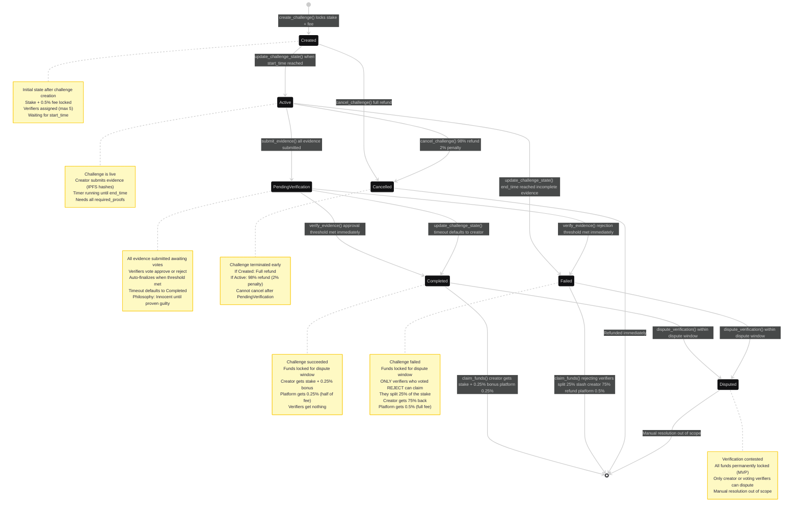

# Proof of Touch Grass

A Solana program that uses financial stakes and social accountability to help you actually complete your goals. Put money on the line, submit evidence, get verified by people you trust.

## Why this works

When you stake actual money on a commitment, suddenly that morning run or daily reading habit feels a lot more urgent. Add verifiers who can call out your BS, and you've got a system that's harder to beat than your average todo list.

The psychology is simple - losing money hurts more than the satisfaction of skipping a workout. And knowing someone's going to review your evidence keeps you honest.

## How it flows



**Create** → Stake SOL, set your goal, pick verifiers, define what counts as proof

**Active** → Submit evidence (photos, data, whatever proves you did the thing)

**Verification** → Your verifiers review and vote. Need enough approvals to win.

**Outcome** → Win and get your stake back + bonus, or fail and verifiers split what you staked

## The Instructions

### `initialize_user`
Creates your profile. Tracks stats across all your challenges.

### `create_challenge`
- Stake SOL (goes into escrow)
- Set timeline (start/end dates, verification window)
- Choose verifiers (people who'll review your evidence)
- Define proof requirements (how many pieces of evidence needed, how many approvals)
- Platform takes 0.5% fee upfront

### `update_challenge_state`
Admin-only. Moves challenges through states automatically based on time:
- Created → Active when start time hits
- Active → Failed if you didn't submit enough evidence by deadline
- Active → Pending Verification if you submitted everything
- Pending Verification → Completed after verification window (innocent until proven guilty)

### `submit_evidence`
Upload proof during the active period. IPFS hash + metadata. When you hit the required count, automatically moves to verification.

### `verify_evidence`
Verifiers vote approve/reject. Early finalization kicks in if the outcome becomes certain.

### `claim_funds`
After the dispute window closes:

**If completed:**
- You get: stake + 0.25% bonus
- Platform gets: remaining 0.25%

**If failed:**
- Verifiers who rejected split 25% of your stake
- You get: 75% back (not totally brutal)
- Platform gets: 0.5%

### `cancel_challenge`
Bail before it's too late:
- Cancel before start: full refund
- Cancel during active: 2% penalty

### `dispute_verification`
48-hour window to challenge sketchy verifier decisions. Moves the challenge to Disputed status for manual review.

## Game Theory

**For you:** Putting real money down makes it harder to bail. You get 75% back if you fail, but you still lose 25% plus it's embarrassing. That's enough to keep you honest.

**For verifiers:** They only make money if they catch fake evidence (they split your 25%). If they approve, they get nothing. So they actually have to review your proof instead of rubber-stamping everything.

**Platform:** We take 0.5% to run things. If you succeed, we drop it to 0.25% and you get the other 0.25% back as a bonus.

## Architecture

```
Challenge (PDA)
    ├── Escrow (PDA) ─── holds stake + fee
    ├── Evidence[0..n] (PDAs) ─── proof submissions
    ├── Verification[verifier1..n] (PDAs) ─── votes
    └── Dispute? (PDA) ─── optional dispute record

User (PDA)
    └── Stats: total challenges, completed, failed, total staked
```

## Instruction Flow

```mermaid
flowchart TB
 subgraph initialize_user["initialize_user"]
        I1_Start["Initialize User"]
        I1_Input["Input:<br>• authority (signer)"]
        I1_Valid{"Valid<br>Inputs?"}
        I1_Create["CREATE USER PDA"]
        I1_Init["Initialize:<br>• authority = signer<br>• total_challenges = 0<br>• completed = 0<br>• failed = 0<br>• total_staked = 0"]
        I1_End["User Account Created"]
        I1_Fail["FAILED TXN"]
  end
 subgraph create_challenge["create_challenge"]
        I2_Start["Create Challenge"]
        I2_Input["Input:<br>• title, description<br>• stake_amount<br>• start_time, end_time<br>• verification_period<br>• required_proofs<br>• required_approvals<br>• verifiers[]"]
        I2_Valid{"Valid<br>Inputs?"}
        I2_Check{"Check:<br>• user exists?<br>• stake &gt; 0?<br>• end &gt; start?<br>• verifiers count valid?<br>• approvals &lt;= verifiers?"}
        I2_CreatePDA["CREATE CHALLENGE PDA"]
        I2_CreateEscrow["CREATE ESCROW PDA"]
        I2_Transfer["TRANSFER SOL:<br>creator → escrow<br>(stake_amount)"]
        I2_Init["Initialize:<br>• creator = signer<br>• status = Created<br>• evidence_count = 0<br>• approval_count = 0<br>• rejection_count = 0"]
        I2_UpdateUser["UPDATE USER:<br>• total_challenges++<br>• total_staked += amount"]
        I2_End["Challenge Created"]
        I2_Fail["FAILED TXN"]
  end
 subgraph submit_evidence["submit_evidence"]
        I3_Start["Submit Evidence"]
        I3_Input["Input:<br>• ipfs_hash<br>• metadata<br>• challenge_id"]
        I3_Valid{"Valid<br>Inputs?"}
        I3_Check{"Check:<br>• submitter = creator?<br>• status = Active?<br>• before end_time?<br>• evidence_count &lt; required?"}
        I3_CreatePDA["CREATE EVIDENCE PDA"]
        I3_Store["Store:<br>• ipfs_hash<br>• timestamp<br>• metadata"]
        I3_Increment["UPDATE CHALLENGE:<br>• evidence_count++"]
        I3_Complete{"evidence_count<br>==<br>required_proofs?"}
        I3_StatusChange["UPDATE STATUS:<br>→ Verifying"]
        I3_End["Evidence Submitted"]
        I3_Fail["FAILED TXN"]
  end
 subgraph verify_evidence["verify_evidence"]
        I4_Start["Verify Evidence"]
        I4_Input["Input:<br>• evidence_id<br>• vote (Approve/Reject)"]
        I4_Valid{"Valid<br>Inputs?"}
        I4_Check@{ label: "Check:<br>• verifier in verifiers[]?<br>• status = Verifying?<br>• before verification_period_end?<br>• verifier hasn't voted?" }
        I4_CreatePDA["CREATE VERIFICATION PDA"]
        I4_Store["Store:<br>• verifier<br>• vote<br>• timestamp"]
        I4_VoteType{"Vote?"}
        I4_Approve["UPDATE CHALLENGE:<br>• approval_count++"]
        I4_Reject["UPDATE CHALLENGE:<br>• rejection_count++"]
        I4_End["Vote Recorded"]
        I4_Fail["FAILED TXN"]
  end
 subgraph finalize_challenge["finalize_challenge"]
        I5_Start["Finalize Challenge"]
        I5_Valid{"Valid<br>State?"}
        I5_Check{"Check:<br>• status = Verifying?<br>• after verification_period_end?"}
        I5_Threshold{"approval_count<br>&gt;=<br>required_approvals?"}
        I5_Success["SUCCESS PATH:<br>• status → Completed<br>• user.completed++"]
        I5_CalcBonus["Calculate Bonus:<br>(from rewards pool)"]
        I5_Refund["TRANSFER SOL:<br>escrow → creator<br>(stake + bonus)"]
        I5_SuccessEnd["Challenge Completed"]
        I5_Failure["FAILURE PATH:<br>• status → Failed<br>• user.failed++"]
        I5_CalcShares["Calculate Shares:<br>stake / active_verifiers"]
        I5_MarkRewards["Mark rewards available<br>for claim_rewards()"]
        I5_FailureEnd["Challenge Failed"]
        I5_Fail["FAILED TXN"]
  end
 subgraph cancel_challenge["cancel_challenge"]
        I6_Start["Cancel Challenge"]
        I6_Valid{"Valid<br>State?"}
        I6_Check{"Check:<br>• signer = creator?<br>• status = Created/Active?<br>• before end_time?"}
        I6_Fee["Calculate Penalty:<br>(e.g., 0.2% of stake)"]
        I6_State{"Status = Active?"}
        I6_Refund["TRANSFER SOL:<br>escrow → creator<br>(stake - penalty)<br>escrow → platform<br>(penalty)"]
        I6_UpdateStatus["UPDATE:<br>• status → Cancelled"]
        I6_End["Challenge Cancelled"]
        I6_Fail["FAILED TXN"]
  end
 subgraph dispute_verification["dispute_verification"]
        I7_Start["Dispute Verification"]
        I7_Input["Input:<br>• challenge_id<br>• reason"]
        I7_Valid{"Valid<br>Inputs?"}
        I7_Check{"Check:<br>• status = Completed/Failed?<br>• within dispute window?<br>• disputer is creator/verifier?"}
        I7_CreatePDA["CREATE DISPUTE PDA"]
        I7_Store["Store:<br>• challenge_id<br>• disputer<br>• reason<br>• timestamp"]
        I7_Lock["LOCK ESCROW:<br>prevent any transfers"]
        I7_UpdateStatus["UPDATE:<br>• status → Disputed"]
        I7_End["Dispute Filed"]
        I7_Fail["FAILED TXN"]
  end
 subgraph claim_rewards["claim_rewards"]
        I8_Start["Claim Rewards"]
        I8_Input["Input:<br>• challenge_id"]
        I8_Valid{"Valid<br>State?"}
        I8_Check{"Check:<br>• status = Failed?<br>• claimant is verifier?<br>• claimant voted?<br>• not already claimed?"}
        I8_CalcShare["Calculate Share:<br>(slashed_stake / active_verifiers)"]
        I8_Transfer["TRANSFER SOL:<br>escrow → verifier<br>(their share)"]
        I8_Mark["MARK:<br>verification.claimed = true"]
        I8_End["Rewards Claimed"]
        I8_Fail["FAILED TXN"]
  end
    Start(["Challenger Begins"]) --> I1_Start
    I1_Start --> I1_Input
    I1_Input --> I1_Valid
    I1_Valid -- YES --> I1_Create
    I1_Valid -- NO --> I1_Fail
    I1_Create --> I1_Init
    I1_Init --> I1_End
    I1_End --> I2_Start
    I2_Start --> I2_Input
    I2_Input --> I2_Valid
    I2_Valid -- NO --> I2_Fail
    I2_Valid -- YES --> I2_Check
    I2_Check -- NO --> I2_Fail
    I2_Check -- YES --> I2_CreatePDA
    I2_CreatePDA --> I2_CreateEscrow
    I2_CreateEscrow --> I2_Transfer
    I2_Transfer --> I2_Init
    I2_Init --> I2_UpdateUser
    I2_UpdateUser --> I2_End
    I2_End --> I3_Start
    I2_End -. optional early exit .-> I6_Start
    I3_Start --> I3_Input
    I3_Input --> I3_Valid
    I3_Valid -- NO --> I3_Fail
    I3_Valid -- YES --> I3_Check
    I3_Check -- NO --> I3_Fail
    I3_Check -- YES --> I3_CreatePDA
    I3_CreatePDA --> I3_Store
    I3_Store --> I3_Increment
    I3_Increment --> I3_Complete
    I3_Complete -- NO --> I3_End
    I3_Complete -- YES --> I3_StatusChange
    I3_StatusChange --> I3_End
    I3_End -- loop until all evidence --> I3_Start
    I3_End -. all evidence submitted .-> I4_Start
    I4_Start --> I4_Input
    I4_Input --> I4_Valid
    I4_Valid -- NO --> I4_Fail
    I4_Valid -- YES --> I4_Check
    I4_Check -- NO --> I4_Fail
    I4_Check -- YES --> I4_CreatePDA
    I4_CreatePDA --> I4_Store
    I4_Store --> I4_VoteType
    I4_VoteType -- Approve --> I4_Approve
    I4_VoteType -- Reject --> I4_Reject
    I4_Approve --> I4_End
    I4_Reject --> I4_End
    I4_End -- loop for each verifier --> I4_Start
    I4_End -. after verification period .-> I5_Start
    I5_Start --> I5_Valid
    I5_Valid -- NO --> I5_Fail
    I5_Valid -- YES --> I5_Check
    I5_Check -- NO --> I5_Fail
    I5_Check -- YES --> I5_Threshold
    I5_Threshold -- YES --> I5_Success
    I5_Success --> I5_CalcBonus
    I5_CalcBonus --> I5_Refund
    I5_Refund --> I5_SuccessEnd
    I5_Threshold -- NO --> I5_Failure
    I5_Failure --> I5_CalcShares
    I5_CalcShares --> I5_MarkRewards
    I5_MarkRewards --> I5_FailureEnd
    I5_SuccessEnd --> End1(["Creator Happy"])
    I5_FailureEnd --> I8_Start
    I5_SuccessEnd -. if disputed .-> I7_Start
    I5_FailureEnd -. if disputed .-> I7_Start
    I6_Start --> I6_Valid
    I6_Valid -- NO --> I6_Fail
    I6_Valid -- YES --> I6_Check
    I6_Check -- NO --> I6_Fail
    I6_State -- YES --> I6_Fee
    I6_Check -- YES --> I6_State
    I6_State -- NO --> I6_UpdateStatus
    I6_Fee --> I6_Refund
    I6_Refund --> I6_UpdateStatus
    I6_UpdateStatus --> I6_End
    I6_End --> End2(["Cancelled"])
    I7_Start --> I7_Input
    I7_Input --> I7_Valid
    I7_Valid -- NO --> I7_Fail
    I7_Valid -- YES --> I7_Check
    I7_Check -- NO --> I7_Fail
    I7_Check -- YES --> I7_CreatePDA
    I7_CreatePDA --> I7_Store
    I7_Store --> I7_Lock
    I7_Lock --> I7_UpdateStatus
    I7_UpdateStatus --> I7_End
    I7_End --> End3(["Awaiting Resolution"])
    I8_Start --> I8_Input
    I8_Input --> I8_Valid
    I8_Valid -- NO --> I8_Fail
    I8_Valid -- YES --> I8_Check
    I8_Check -- NO --> I8_Fail
    I8_Check -- YES --> I8_CalcShare
    I8_CalcShare --> I8_Transfer
    I8_Transfer --> I8_Mark
    I8_Mark --> I8_End
    I8_End --> End4(["Verifier Paid"])
    I4_Check@{ shape: diamond}
     I1_Start:::startStyle
     I1_Input:::inputStyle
     I1_Valid:::validStyle
     I1_Create:::actionStyle
     I1_Init:::actionStyle
     I1_End:::endStyle
     I1_Fail:::failStyle
     I2_Start:::startStyle
     I2_Input:::inputStyle
     I2_Valid:::validStyle
     I2_Check:::decisionStyle
     I2_CreatePDA:::actionStyle
     I2_CreateEscrow:::actionStyle
     I2_Transfer:::actionStyle
     I2_Init:::actionStyle
     I2_UpdateUser:::actionStyle
     I2_End:::endStyle
     I2_Fail:::failStyle
     I3_Start:::startStyle
     I3_Input:::inputStyle
     I3_Valid:::validStyle
     I3_Check:::decisionStyle
     I3_CreatePDA:::actionStyle
     I3_Store:::actionStyle
     I3_Increment:::actionStyle
     I3_Complete:::decisionStyle
     I3_StatusChange:::actionStyle
     I3_End:::endStyle
     I3_Fail:::failStyle
     I4_Start:::startStyle
     I4_Input:::inputStyle
     I4_Valid:::validStyle
     I4_Check:::decisionStyle
     I4_CreatePDA:::actionStyle
     I4_Store:::actionStyle
     I4_VoteType:::decisionStyle
     I4_Approve:::actionStyle
     I4_Reject:::actionStyle
     I4_End:::endStyle
     I4_Fail:::failStyle
     I5_Start:::startStyle
     I5_Valid:::validStyle
     I5_Check:::decisionStyle
     I5_Threshold:::decisionStyle
     I5_Success:::actionStyle
     I5_CalcBonus:::actionStyle
     I5_Refund:::actionStyle
     I5_SuccessEnd:::endStyle
     I5_Failure:::actionStyle
     I5_CalcShares:::actionStyle
     I5_MarkRewards:::actionStyle
     I5_FailureEnd:::endStyle
     I5_Fail:::failStyle
     I6_Start:::startStyle
     I6_Valid:::validStyle
     I6_Check:::decisionStyle
     I6_Fee:::actionStyle
     I6_State:::decisionStyle
     I6_Refund:::actionStyle
     I6_UpdateStatus:::actionStyle
     I6_End:::endStyle
     I6_Fail:::failStyle
     I7_Start:::startStyle
     I7_Input:::inputStyle
     I7_Valid:::validStyle
     I7_Check:::decisionStyle
     I7_CreatePDA:::actionStyle
     I7_Store:::actionStyle
     I7_Lock:::actionStyle
     I7_UpdateStatus:::actionStyle
     I7_End:::endStyle
     I7_Fail:::failStyle
     I8_Start:::startStyle
     I8_Input:::inputStyle
     I8_Valid:::validStyle
     I8_Check:::decisionStyle
     I8_CalcShare:::actionStyle
     I8_Transfer:::actionStyle
     I8_Mark:::actionStyle
     I8_End:::endStyle
     I8_Fail:::failStyle
     Start:::startStyle
     End1:::startStyle
     End2:::startStyle
     End3:::startStyle
     End4:::startStyle
    classDef inputStyle fill:#64B5F6,stroke:#1976D2,stroke-width:2px,color:#000
    classDef validStyle fill:#FFD54F,stroke:#F57C00,stroke-width:2px,color:#000
    classDef actionStyle fill:#81C784,stroke:#388E3C,stroke-width:2px,color:#000
    classDef decisionStyle fill:#FFB74D,stroke:#E64A19,stroke-width:2px,color:#000
    classDef endStyle fill:#AED581,stroke:#558B2F,stroke-width:3px,color:#000
    classDef failStyle fill:#E57373,stroke:#C62828,stroke-width:2px,color:#fff
    classDef startStyle fill:#9575CD,stroke:#5E35B1,stroke-width:3px,color:#fff
```



## Constants

Check `src/constants.rs` for fees, time windows, and limits. Most are configurable except the admin pubkey (for state transitions).

Built on Anchor. Deployed on Solana. With ♥️ for Solana Turbin3 Q4-2025
---
