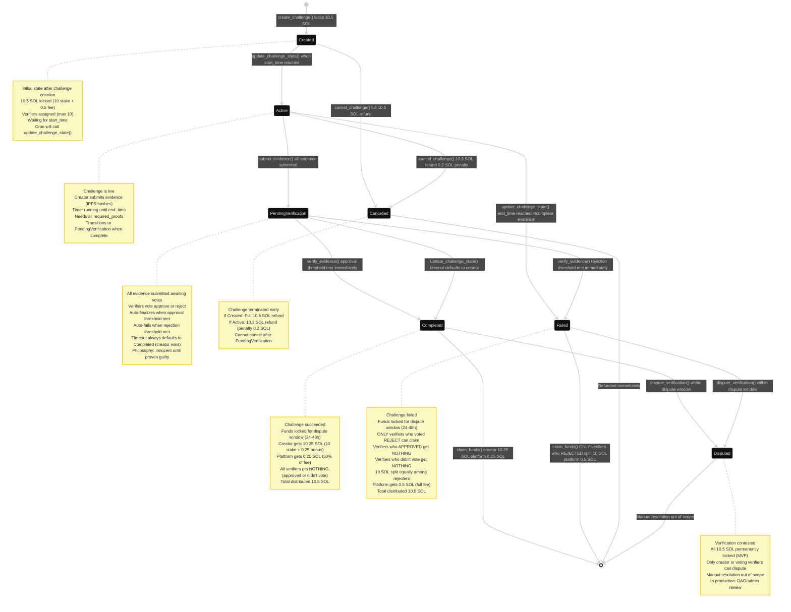

# Proof of Touch Grass - Challenge State Machine



## Challenge States

### 1. **Created** (Initial State)
**Description:** Challenge has been created and funds are locked in escrow.

**State Properties:**
- 10.5 SOL locked in escrow (10 SOL stake + 0.5 SOL platform fee)
- Verifiers assigned (max 10)
- Waiting for `start_time` to be reached
- No evidence submitted yet

**Who can trigger exit:**
- Cron job (automatic transition to Active)
- Creator (manual cancellation)

---

### 2. **Active** (Challenge Running)
**Description:** Challenge is live and creator can submit evidence.

**State Properties:**
- Creator can call `submit_evidence()` with IPFS hashes
- Timer running: must complete before `end_time`
- Tracks `evidence_count` vs `required_proofs`
- Escrow remains locked

**Who can trigger exit:**
- Creator (by submitting all evidence → PendingVerification)
- Cron job (if `end_time` reached → Failed)
- Creator (manual cancellation with penalty)

---

### 3. **PendingVerification** (Awaiting Votes)
**Description:** All required evidence submitted, waiting for verifier votes.

**State Properties:**
- Evidence is frozen (no more submissions)
- Verifiers cast Approve/Reject votes via `verify_evidence()`
- Tracks `approval_count` and `rejection_count`
- Verification period timer running

**Auto-finalization triggers:**
- Approval threshold met → **Completed**
- Rejection threshold met → **Failed**
- Timeout → **Always Completed** (innocent until proven guilty)

**Who can trigger exit:**
- Verifiers (by reaching approval/rejection threshold)
- Cron job (timeout always defaults to Completed)

---

### 4. **Completed** (Success)
**Description:** Challenge succeeded, funds ready for distribution after dispute window.

**State Properties:**
- Funds locked for dispute window (24-48 hours)
- Creator entitled to 10.25 SOL (stake + bonus)
- Platform receives 0.25 SOL (50% of fee)
- Verifiers receive nothing (even if they approved)

**Who can trigger exit:**
- Creator or verifier (via `dispute_verification()`)
- Anyone (via `claim_funds()` after dispute window expires)

**Fund distribution:**
```
Creator:  10.25 SOL (10 stake + 0.25 bonus)
Platform:  0.25 SOL (50% of 0.5 fee)
Verifiers: 0.00 SOL (no rewards for approvals)
───────────────────
Total:    10.50 SOL
```

---

### 5. **Failed** (Challenge Failed)
**Description:** Challenge failed verification, stake slashed to rejecting verifiers.

**State Properties:**
- Funds locked for dispute window (24-48 hours)
- Only verifiers who voted **REJECT** can claim
- Verifiers who approved get nothing
- Verifiers who didn't vote get nothing
- Platform receives full fee

**Who can trigger exit:**
- Creator or rejecting verifier (via `dispute_verification()`)
- Rejecting verifiers (via `claim_funds()` after dispute window)

**Fund distribution:**
```
Creator:              5.00 SOL (stake slashed)
Rejecting Verifiers:  5.00 SOL (split equally)
Platform:             0.50 SOL (full fee)
Approving Verifiers:  0.00 SOL (wrong vote)
Non-voting Verifiers: 0.00 SOL (didn't participate)
──────────────────────────────
Total:               10.50 SOL
```

**Example:** If 3 verifiers voted REJECT and 2 voted APPROVE:
- Each rejecting verifier gets: 10.00 SOL / 3 = 3.33 SOL
- Approving verifiers get: 0 SOL

---

### 6. **Cancelled** (Early Termination)
**Description:** Creator terminated challenge before completion.

**State Properties:**
- Immediate refund (no dispute window)
- Penalty depends on when cancelled

**Cancellation Penalties:**
| From State | Refund | Penalty | Platform Keeps |
|------------|--------|---------|----------------|
| Created    | 10.5 SOL | 0.0 SOL | 0.0 SOL (full refund) |
| Active     | 10.3 SOL | 0.2 SOL | 0.2 SOL |
| PendingVerification+ | ❌ Cannot cancel | - | - |

**Who can trigger exit:**
- Automatic (immediate refund upon cancellation)

---

### 7. **Disputed** (Under Review)
**Description:** Challenge outcome has been contested, funds locked.

**State Properties:**
- All 10.5 SOL permanently locked (MVP scope)
- Only creator OR voting verifiers can file dispute
- No automatic resolution (manual/DAO intervention required)

**Who can dispute:**
- Creator (if they believe verification was unfair)
- Verifiers who voted (if they believe evidence was fake)

**Resolution (out of scope for MVP):**
- In production: DAO vote or admin review
- For MVP: funds remain locked indefinitely
---

## Testing Checklist

- [ ] Challenge transitions from Created to Active at exact start_time
- [ ] Challenge fails if evidence incomplete at end_time
- [ ] Challenge auto-finalizes when approval threshold reached
- [ ] Challenge auto-finalizes when rejection threshold reached
- [ ] Challenge defaults to Completed if no votes after verification period
- [ ] Cancellation from Created gives full refund
- [ ] Cancellation from Active charges 0.2 SOL penalty
- [ ] Cancellation from PendingVerification is rejected
- [ ] Dispute can be filed within dispute window
- [ ] Dispute cannot be filed after dispute window
- [ ] Only rejecting verifiers can claim on Failed challenge
- [ ] Each verifier can only claim once
- [ ] Platform fee is correctly distributed in all scenarios
- [ ] Escrow is fully drained after all claims (no dust)
- [ ] State transitions are atomic (no partial updates)
