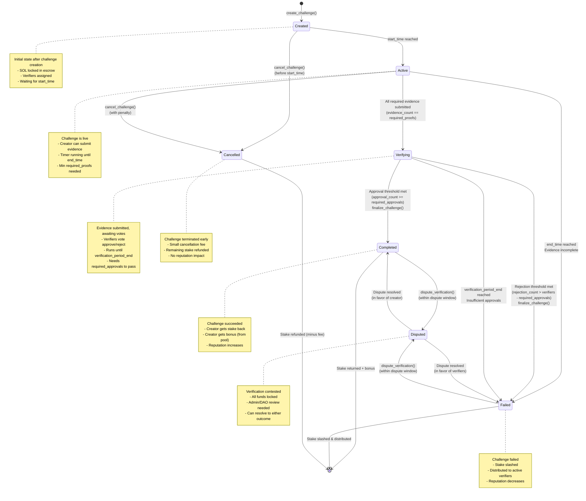

# Proof of Touch Grass -  State Diagram

## State Transitions Overview

### Challenge States

1. **Created** → Initial state with stake locked in escrow, waiting for start_time
2. **Active** → Challenge is live, creator can submit evidence until end_time
3. **Verifying** → All evidence submitted, verifiers vote within verification period
4. **Completed** → Success! Creator receives stake back + bonus reward
5. **Failed** → Evidence rejected or incomplete, stake slashed to verifiers
6. **Cancelled** → Early termination with small penalty, stake mostly refunded
7. **Disputed** → Contested outcome, all funds locked pending resolution
